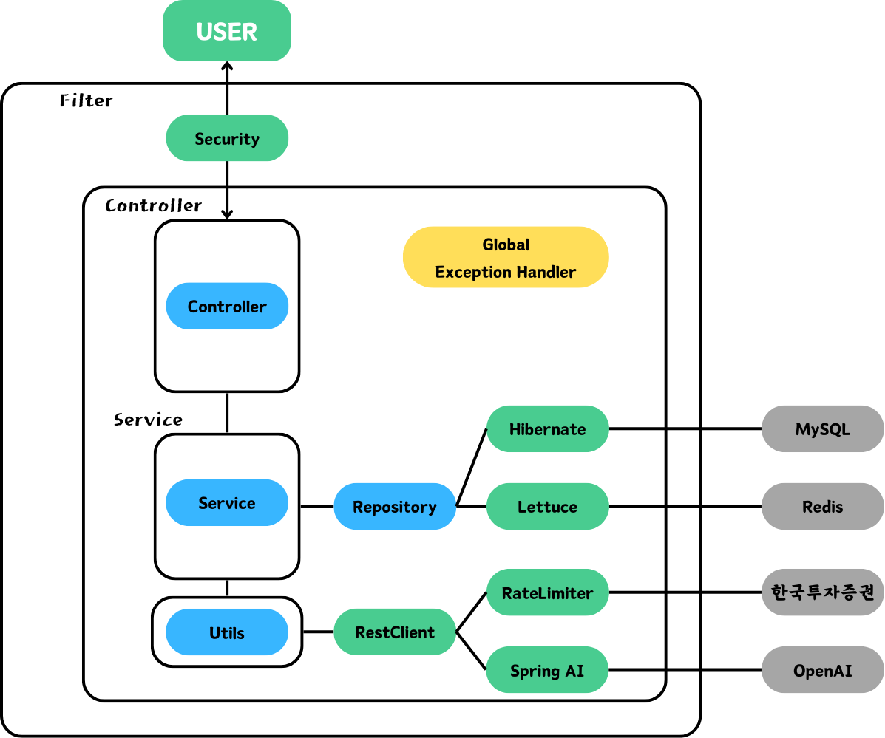
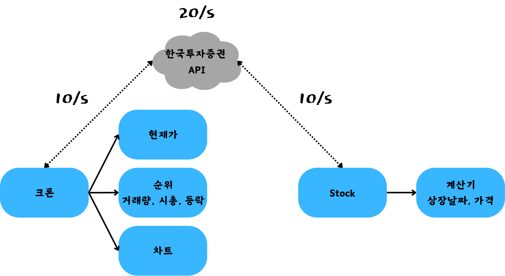

<p align="center"> 
  
</p>
<h1 align="center"> U'STOCK </h1>
<h3 align="center"> 뉴스 중심의 차트 분석 서비스 U'STOCK의 backend repository </h3>
<h5 align="center"> 카카오테크 부트캠프 클라우드 네이티브 제주 1기 2팀 HRTH (2024-07-02 ~ 2024-10-11) </h5>

# TODO: 프로젝트 영상 추가?
<p align="center"> 
  
</p>

<!-- 목차 -->
<h2 id="table-of-contents"> :book: 목차</h2>

<details open="open">
  <summary>목차</summary>
  <ol>
    <li><a href="#architecture"> ➤ 아키텍쳐</a></li>
    <li><a href="#tech"> ➤ 기술 스택</a></li>
    <li><a href="#directory"> ➤ 디렉토리 구조</a></li>
    <li><a href="#trouble"> ➤ 트러블 슈팅</a></li>
    <li><a href="#refactor"> ➤ 리팩토링</a></li>
    <li><a href="#api"> ➤ REST API 개요</a></li>
    <li><a href="#stocks"> ➤ /v1/stocks</a></li>
    <li><a href="#portfolio"> ➤ /v1/portfolio</a></li>
    <li><a href="#news"> ➤ /v1/news</a></li>
    <li><a href="#game"> ➤ /v1/game</a></li>
    <li><a href="#teammates"> ➤ 팀 소개</a></li>
  </ol>
</details>


<!-- 아키텍쳐 -->
<h2 id="architecture"> 🏙️ 아키텍쳐</h2>



# DevOps 구조도 추가 예정 - tree 위 or 아래에 추가

<hr>
<!-- 기술 스택 -->
<h3 id="tech"> 🔸 기술 스택</h3>

| 분류 | 기술 |
| :------: | --- |
|Language| |
|Framework| |
|Library| |
|DB|    |
|Server| |
|DevOps|  |
|Monitoring|    |

<hr>
<!-- BE 디렉토리 구조 -->
<h3 id="directory"> 🔸 디렉토리 구조</h3>

```
  .
  └── src
      └── main
          └── java
              └── com
                  └── hrth
                      └── ustock
                          ├── UstockApplication.java
                          ├── config
                          ├── controller
                          │   ├── api
                          │   ├── common
                          │   ├── game
                          │   └── main
                          ├── dto
                          │   ├── game
                          │   │   ├── ai
                          │   │   ├── hint
                          │   │   ├── interim
                          │   │   ├── redis
                          │   │   ├── result
                          │   │   ├── stock
                          │   │   └── user
                          │   ├── main
                          │   │   ├── chart
                          │   │   ├── holding
                          │   │   ├── news
                          │   │   ├── portfolio
                          │   │   └── stock
                          │   └── oauth2
                          ├── entity
                          │   ├── game
                          │   └── main
                          ├── exception
                          │   ├── common
                          │   ├── domain
                          │   │   ├── chart
                          │   │   ├── game
                          │   │   ├── portfolio
                          │   │   ├── stock
                          │   │   └── user
                          │   ├── kisapi
                          │   └── redis
                          ├── jwt
                          ├── oauth2
                          ├── repository
                          │   ├── game
                          │   └── main
                          ├── service
                          │   ├── auth
                          │   ├── cron
                          │   ├── game
                          │   └── main
                          └── util
```


<!-- 트러블 슈팅 -->
<h2 id="trouble"> 💡 기술적 한계 및 트러블 슈팅</h2>

<h3> 🔸 API 20회 제한</h3>

<h5 align="center">한국투자증권 api 요청 분배</h5>

```
--문제--
- 한국투자증권 API는 초당 20회 요청 제한이 있음
- 해당 API를 데이터 수집(서버), 과거 종목가격 확인(사용자) 2곳에서 사용하는 중
- 예외처리와 별개로 API 요청이 초당 20회를 초과하지 않도록 제한이 필요

--해결--
- resilience4j의 RateLimiter를 활용해 사용자 10회, 서버 10회로 분리
- 사용자와 서버를 분리한 이유
- 1. 서버의 데이터 수집과 사용자의 요청이 겹칠 시, 요청이 지연되는 현상을 방지
- 2. 스레드 인터럽트로 인해 발생하는 예외 회피

--단점--
- 사용자 요청이 초당 10회로 제한되고, 서버가 요청 횟수 10회를 전부 사용할 때가 몇 없음
- 우선순위 큐를 통해 api 요청 횟수를 최대한 활용할 수 있을것으로 보임
```

<hr>
<h3> 🔸 중복된 뉴스 데이터 처리</h3>

```
--문제--
- 뉴스 크롤링 중 제목 또는 내용이 유사한 뉴스들이 대거 들어와 데이터 품질을 떨어뜨림

--해결--
- 형태소 분석 라이브러리인 Komoran을 사용해 유사한 뉴스를 제거함
```

<hr>
<h3> 🔸 뉴스 데이터 편향 문제</h3>

```
--문제--
- 뉴스 데이터 전송 시, 인기종목의 뉴스만 조회되어 비인기종목의 뉴스가 소외되는 현상

--해결--
- 종목별 n개씩 뉴스를 가져온 뒤 랜덤으로 섞고, 상위 n개만 날짜별로 정렬
```

<hr>
<h3> 🔸 게임정보 저장 문제</h3>

```
--문제--
- MySQL에 게임 진행상황을 저장하려니 읽기/쓰기가 너무 많아져 효율이 떨어지고, 스키마가 복잡해짐

--해결--
- Redis의 HashMap형태 자료구조로 데이터를 Dto형태로 저장
```

<hr>
<h3> 🔸 게임 AI 응답값 문제</h3>

```
--문제--
- OpenAI gpt-4o-mini의 응답값에서 예외가 발생
- 1. 응답값의 금액이 맞지 않아 예수금을 초과하는 문제
- 2. 응답 맨 위에 ```나 json 등 문자열이 추가되거나, []가 {}로 대체되는 등의 문제

--해결--
- 1.
- sell과 buy 요청을 동시에 진행해 프롬프트가 길어짐에 따라 발생한 문제
- sell요청과 buy요청을 분리하여 프롬프트를 단축하고, ai가 복잡한 계산을 진행하지 않도록 조치
- 2.
- ```과 json등 맞지 않는 문자들을 예외 처리, []자리에 {}가 오면 []로 대체하여 해결
```

<hr>
<h3> 🔸 </h3>


<!-- 리팩토링 -->
<h2 id="refactor"> 🔧 리팩토링</h2>

<h3> 🔸 전역 예외처리 (AOP)</h3>

```
- Controller에서 try-catch로 처리하니 컨트롤러 코드가 복잡해짐
- AOP를 활용한 전역 예외처리 코드를 도입
```

<hr>
<h3> 🔸 운영, 개발서버 분리</h3>

```
- main branch를 배포용 서버로, develop branch를 개발용 서버로 분리함
- profile을 다르게 하여 스케줄러 등 main과 develop의 기능을 나눔
```

<hr>
<h3> 🔸 모니터링 툴 도입</h3>


```
- Prometheus와 Grafana를 활용해 모니터링 대시보드 도입
- Loki와 Promtail으로 로그를 마운트하여 로그 모니터링 도입
```

<hr>
<h3> 🔸 Swagger 도입</h3>


```
- 기존 Notion으로 진행하던 api 명세서 작성을 Swagger로 대체
- spring 코드로 명세서를 작성하고, springdoc-opanAPI 라이브러리를 통해 api명세서를 조회할 수 있음
```

<hr>
<h3> 🔸 스케줄러 도입</h3> 

```
- 현재가, 순위, 차트 데이터를 매일 갱신하기 위해 spring scheduler 도입
- 크론 표현식을 지정하여 원하는 시간에 로직이 동작하도록 처리
- SchedulerConfig 파일으로 병렬 처리 설정
```

- SchedulerConfig
```
@Configuration
@EnableScheduling
public class SchedulerConfig implements SchedulingConfigurer {

    @Override
    public void configureTasks(ScheduledTaskRegistrar taskRegistrar) {
        taskRegistrar.setTaskScheduler(taskScheduler());
    }

    @Bean
    public ThreadPoolTaskScheduler taskScheduler() {
        ThreadPoolTaskScheduler taskScheduler = new ThreadPoolTaskScheduler();
        taskScheduler.setPoolSize(10);
        taskScheduler.setThreadNamePrefix("scheduled-task-pool-");
        taskScheduler.initialize();
        return taskScheduler;
    }
}
```


<hr>
<h3> 🔸 종목 코드와 종목명 둘 다 검색</h3>

```
- 종목 코드 검색시 종목 코드 기준으로, 종목명 검색시 종목명 기준으로 검색하도록 구현
- stockCodeRegex 기준으로 실행할 쿼리를 구분함
```

- code
```
        String stockCodeRegex = "^\\d{1,6}$|^Q\\d{1,6}$";

        List<Stock> list;
        if (query.matches(stockCodeRegex)) {
            list = stockRepository.findByCodeStartingWith(query);
            list.addAll(stockRepository.findByCodeContainingButNotStartingWith(query));
        } else {
            list = stockRepository.findByNameStartingWith(query);
            list.addAll(stockRepository.findByNameContainingButNotStartingWith(query));
        }
```

<hr>
<h3> 🔸 종목 검색 최적화</h3>

```
- 종목 검색칸 클릭 시 첫 응답까지 시간이 오래 걸림(약 3~4초)
- 검색칸에서 스페이스바를 입력하면 공백이 입력되는데, 첫 응답과 동일한 시간이 소요됨
- 한 글자라도 입력하면 응답속도가 빠름
- 공백을 입력하면 LIKE 쿼리의 소요 시간이 늘어나므로, 공백이 입력되지 않도록 예외처리 진행
```


<!-- api 개요 -->
<h2 id="api"> 📜 REST API 개요</h2>
<p>
  /stocks 제외 모든 endpoint는 OAuth2 로그인이 필요합니다.
</p>

<h3> 🔸 메인 서비스</h3>

- /stocks
- /portfolio
- /news

<h3> 🔸 스껄 게임</h3>

- /game


<!-- main -->
<h3 id="stocks">  /stocks</h3>

|메소드|엔드포인트|설명|
|:---:|:---|:---|
|GET|/v1/stocks|종목 순위 리스트|
|GET|/v1/stocks/market|코스피, 코스닥 지수|
|GET|/v1/stocks/search|종목 검색|
|GET|/v1/stocks/{code}|종목 조회|
|GET|/v1/stocks/{code}/chart|차트 조회|
|GET|/v1/stocks/{code}/skrrr|스껄계산기|

<!-- main -->
<h3 id="portfolio">  /portfolio</h3>

|메소드|엔드포인트|설명|
|:---:|:---|:---|
|GET|/v1/portfolio|보유 포트폴리오 리스트 조회|
|POST|/v1/portfolio|포트폴리오 생성|
|GET|/v1/portfolio/{pfid}|포트폴리오 조회|
|GET|/v1/portfolio/{pfid}|포트폴리오 삭제|
|DELETE|/v1/portfolio/{pfid}/holding/{code}|종목 수정|
|PUT|/v1/portfolio/{pfid}/holding/{code}|종목 매수|
|POST|/v1/portfolio/{pfid}/holding/{code}|보유 종목 삭제|
|DELETE|/v1/portfolio/{pfid}/holding/{code}|종목 추가 매수|
|PATCH|/v1/portfolio/{pfid}/holding/{code}|포트폴리오 보유 여부 확인|

<!-- main -->
<h3 id="news">  /news</h3>

|메소드|엔드포인트|설명|
|:---:|:---|:---|
|GET|/v1/news/user|나만의 뉴스 조회|

<!-- game -->
<h3 id="game">  /game</h3>

|메소드|엔드포인트|설명|
|:---:|:---|:---|
|GET|/v1/game/start|게임 정보 초기화+시작|
|GET|/v1/game/user|유저 정보 조회 요청|
|POST|/v1/game/stock|종목 거래 요청|
|GET|/v1/game/hint|정보 거래소 힌트 조회|
|GET|/v1/game/interim|다음 연도로 진행|
|GET|/v1/game/result|최종 결과 조회|
|GET|/v1/game/result/stock|게임 내 종목 리스트 조회|
|POST|/v1/game/result/save|게임 결과 저장|
|GET|/v1/game/ranking|게임 랭킹 리스트 조회|
