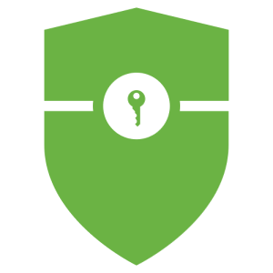

<p align="center"> 
  
</p>
<h1 align="center"> U'STOCK </h1>
<h3 align="center"> 뉴스 중심의 차트 분석 서비스 U'STOCK의 backend repository </h3>
<h5 align="center"> 카카오테크부트캠프 클라우드 in JEJU 2팀 HRTH (2024-07-02 ~ 2024-10-11) </h5>

# TODO: 프로젝트 영상 추가
<p align="center"> 
  
</p>

<!-- 목차 -->
<h2 id="table-of-contents"> :book: 목차</h2>

<details open="open">
  <summary>목차</summary>
  <ol>
    <li><a href="#architecture"> ➤ 아키텍쳐</a></li>
    <li><a href="#tech"> ➤ 기술 스택</a></li>
    <li><a href="#directory"> ➤ 디렉토리 구조</a></li>
    <li><a href="#api"> ➤ REST API 개요</a></li>
    <li><a href="#stocks"> ➤ /v1/stocks</a></li>
    <li><a href="#portfolio"> ➤ /v1/portfolio</a></li>
    <li><a href="#news"> ➤ /v1/news</a></li>
    <li><a href="#game"> ➤ /v1/game</a></li>
    <li><a href="#teammates"> ➤ 팀 소개</a></li>
  </ol>
</details>


<!-- 아키텍쳐 -->
<h2 id="architecture"> :small_orange_diamond: 아키텍쳐</h2>

# DevOps 구조도 추가 예정 - tree 위 or 아래에 추가

<!-- 기술 스택 -->
<h2 id="tech"> :small_orange_diamond: 기술 스택</h2>

| 분류 | 기술 |
| :------: | --- |
|Language| |
|Framework| |
|Library| |
|DB|    |
|Server| |
|DevOps|  |
|Monitoring|   |

<!-- BE 디렉토리 구조 -->
<h2 id="directory"> :small_orange_diamond: 디렉토리 구조</h2>

```
  .
  └── src
      └── main
          └── java
              └── com
                  └── hrth
                      └── ustock
                          ├── UstockApplication.java
                          ├── config
                          ├── controller
                          │   ├── api
                          │   ├── common
                          │   ├── game
                          │   └── main
                          ├── dto
                          │   ├── game
                          │   │   ├── ai
                          │   │   ├── hint
                          │   │   ├── interim
                          │   │   ├── redis
                          │   │   ├── result
                          │   │   ├── stock
                          │   │   └── user
                          │   ├── main
                          │   │   ├── chart
                          │   │   ├── holding
                          │   │   ├── news
                          │   │   ├── portfolio
                          │   │   └── stock
                          │   └── oauth2
                          ├── entity
                          │   ├── game
                          │   └── main
                          ├── exception
                          │   ├── common
                          │   ├── domain
                          │   │   ├── chart
                          │   │   ├── game
                          │   │   ├── portfolio
                          │   │   ├── stock
                          │   │   └── user
                          │   ├── kisapi
                          │   └── redis
                          ├── jwt
                          ├── oauth2
                          ├── repository
                          │   ├── game
                          │   └── main
                          ├── service
                          │   ├── auth
                          │   ├── cron
                          │   ├── game
                          │   └── main
                          └── util
```


<!-- api 개요 -->
<h2 id="api"> REST API 개요</h2>

<h3>메인 서비스</h3>

- /stocks
-  /portfolio
- /news

<h3>스껄 게임</h3>

- /game


<!-- main -->
<h2 id="stocks"> :small_orange_diamond: /stocks</h2>

|메소드|엔드포인트|설명|
|:---:|:---|:---|
|GET|/v1/stocks|종목 순위 리스트|
|GET|/v1/stocks/market|코스피, 코스닥 지수|
|GET|/v1/stocks/search|종목 검색|
|GET|/v1/stocks/{code}|종목 조회|
|GET|/v1/stocks/{code}/chart|차트 조회|
|GET|/v1/stocks/{code}/skrrr|스껄계산기|

<!-- main -->
<h2 id="portfolio">  /portfolio</h2>


|메소드|엔드포인트|설명|
|:---:|:---|:---|
|GET|/v1/portfolio|보유 포트폴리오 리스트 조회|
|POST|/v1/portfolio|포트폴리오 생성|
|GET|/v1/portfolio/{pfid}|포트폴리오 조회|
|GET|/v1/portfolio/{pfid}|포트폴리오 삭제|
|DELETE|/v1/portfolio/{pfid}/holding/{code}|종목 수정|
|PUT|/v1/portfolio/{pfid}/holding/{code}|종목 매수|
|POST|/v1/portfolio/{pfid}/holding/{code}|보유 종목 삭제|
|DELETE|/v1/portfolio/{pfid}/holding/{code}|종목 추가 매수|
|PATCH|/v1/portfolio/{pfid}/holding/{code}|포트폴리오 보유 여부 확인|

<!-- main -->
<h2 id="news">  /news</h2>


|메소드|엔드포인트|설명|
|:---:|:---|:---|
|GET|/v1/news/user|나만의 뉴스 조회|

<!-- game -->
<h2 id="game"> :small_orange_diamond: /game</h2>


|메소드|엔드포인트|설명|
|:---:|:---|:---|
|GET|/v1/stocks|종목 순위 리스트|
|GET|/v1/stocks/market|코스피, 코스닥 지수|
|GET|/v1/stocks/search|종목 검색|
|GET|/v1/stocks/{code}|종목 조회|
|GET|/v1/stocks/{code}/chart|차트 조회|
|GET|/v1/stocks/{code}/skrrr|스껄계산기|

